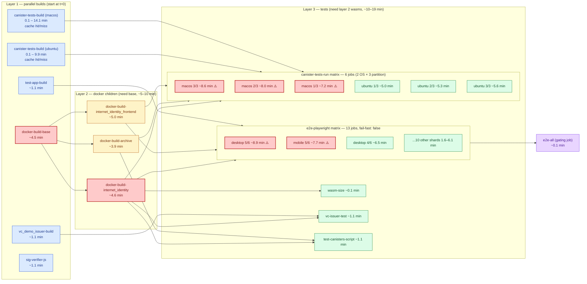

# Internet Identity — CI pipeline analysis

> Snapshot of `dfinity/internet-identity` GitHub Actions performance on PR builds, taken **2026-05-06**. Based on the 30 most recent successful PR runs of the `Canister tests` workflow plus 15 each of `Rust` and `Frontend checks and lints`, with full per-job timing pulled for 5 representative runs.

## TL;DR

- **PR critical path is ~18.5 min** (median). It runs in three serial layers: `docker-build-base` → `docker-build-internet_identity` → the slowest test shard. Everything else fans out *around* that spine.
- **Top bottleneck: `e2e-playwright (desktop, 5_6)` at ~9 min**, ties for slowest tail with `canister-tests-run (macos-latest, 2/3 or 3/3)`.
- **macOS runners cost a lot of wall-clock** — `canister-tests-run` on macOS is ~50–60% slower than Ubuntu for the same partition, and macOS minutes are ~10× more expensive on hosted runners.
- **Playwright shard imbalance** — slowest shard (`5_6`) is ~2× slower than the fastest (`3_6`), because `--shard=N/M` splits by spec-file count, not by execution time.
- **Layer hand-off is tight (<1 min slack)** — pipeline is well wired, the wins are in shrinking the layers themselves, not in re-stitching dependencies.

---

## Workflows that run on every PR

| Workflow | Median | Range | Jobs | Notes |
|---|---|---|---|---|
| **Canister tests** (`canister-tests.yml`) | **18.6 min** | 5.3 – 22.7 min | 30 (post-skip) | The big one. Docker builds + Rust integration tests + Playwright e2e. |
| Rust (`rust.yml`) | 3.3 min | 3.1 – 8.8 min | 3 (parallel) | `cargo-fmt`, `cargo-clippy`, `check-lockfile` — independent, run in parallel. |
| Frontend checks (`frontend-checks.yml`) | 1.7 min | 1.5 – 1.9 min | 1 | `tsc`, ESLint, Prettier, didc generate, dapp logo check. |

These three run independently of each other (separate workflow files), so PR signal returns when the slowest finishes — almost always **Canister tests**.

---

## Pipeline shape (Canister tests workflow)

The 30 jobs in `canister-tests.yml` form three serial layers, with two layer-1 “sidecars” (`canister-tests-build` matrix and other independent builds) that join layer 3 directly. PR-only skipped jobs (`release`, `deploy`) are omitted from the diagram.



### Critical path (typical run, 19.4 min wall-clock, 18.6 min median across 30 runs)

```mermaid
gantt
  title Critical path on a typical PR (run 25438352529)
  dateFormat X
  axisFormat %M:%S

  section Layer 1
  docker-build-base                : crit, 0, 290
  canister-tests-build (mac, cached) : 0, 240
  vc_demo_issuer-build           : 5, 70
  test-app-build                 : 5, 60

  section Layer 2
  docker-build-internet_identity : crit, 305, 575
  docker-build-archive           : 305, 535
  docker-build-frontend          : 305, 600

  section Layer 3
  e2e-playwright desktop 5_6     : crit, 615, 1150
  canister-tests-run mac 3_3     : 615, 1195
  e2e-playwright mobile 5_6      : 615, 1085
  canister-tests-run mac 2_3     : 615, 1040

  section Layer 4
  e2e-all                        : crit, 1165, 1170
```



The chain that defines wall-clock time is:

> `docker-build-base` (4.8 min)  →  `docker-build-internet_identity` (4.5 min)  →  `e2e-playwright (desktop, 5_6)` (8.9 min)  →  `e2e-all` (0.1 min)
>
> ≈ **18.3 min**, dominating the 19.4 min observed total.

Layer hand-off slack is only ~0.5 min between L2 and L3 — i.e. the runner pool is already keeping up with fan-out. **You will not buy time by reorganising dependencies; you have to make a layer faster.**

---

## Bottlenecks ranked

### 1. `docker-build-base` is a 4.5 min serial gate — *the* bottleneck

Every `docker-build-*` child needs it (it builds `target: deps` from the multi-stage `Dockerfile` — pre-compiled Rust deps shared across the three child wasms). It uses GHA cache (`type=gha,scope=cached-stage`), so any `Cargo.lock` / `rust-toolchain.toml` change forces a full rebuild that cascades into all three children.

**Why it’s expensive:** Docker buildx + GHA cache restore is itself ~30–60 s of overhead before a single Rust crate compiles, and cache restoration is single-stream.

**Possible fixes:**
- Skip the `docker-build-base` layer entirely when `Cargo.lock`, `rust-toolchain.toml`, and `Dockerfile` are unchanged in the PR (use `dorny/paths-filter` or hashFiles + cache-only mode).
- Move from `cache-to: mode=max` on `docker-build-base` to a registry cache (ghcr.io) — restore is faster than GHA cache for large layers.
- Combine the three child docker builds (II backend, archive, frontend) into one job that emits all three artifacts. They each pay another ~30 s of buildx setup independently.

### 2. macOS `canister-tests-run` is doubling cost without doubling signal

`canister-tests-run` runs as a 2 OS × 3 partition matrix (6 parallel jobs). The macOS leg is consistently ~50–60% slower:

| OS | partition 1/3 | partition 2/3 | partition 3/3 |
|---|---|---|---|
| ubuntu-latest | 5.0 min | 5.3 min | 5.6 min |
| **macos-latest** | **7.2 min** | **8.0 min** | **8.6 min** |

macOS hosted-runner minutes also bill at ~10× Linux. The macOS leg adds **zero** extra correctness signal that isn’t covered by Ubuntu unless you’re explicitly debugging macOS-only behaviour (you’re running PocketIC + nextest, both cross-platform).

**Fix:** drop macOS from PR runs — keep it on `push: main` and `merge_group` only. PR critical path drops by ~3 min and macOS runner spend drops to near-zero.

### 3. Playwright shard imbalance (5.45× spread, or 2× excluding chrome-extension)

Playwright’s `--shard=N/M` splits **spec files** into N partitions by count. It does *not* balance by historical execution time. Result on this codebase:

```
Shard            avg
desktop 5/6   →  8.9 min  ← critical-path tail
mobile 5/6    →  7.7 min
desktop 4/6   →  6.5 min
desktop 6/6   →  6.1 min
mobile 4/6    →  5.6 min
... (rest 4–5 min)
desktop 3/6   →  4.8 min
mobile 1/6    →  4.7 min
mobile 3/6    →  4.4 min
chrome-ext 1/1 → 1.6 min  (single shard, separate matrix include)
```

Shard 5 of every device is ~80% slower than shard 3. Whatever spec file lands in slot 5 dominates.

**Fixes:**
- Use Playwright’s `--shard` with a custom shard map driven by previous run timings (Playwright supports `globalSetup` / `testMatch` overrides; community plugins exist), or
- Move to test-level sharding instead of file-level (raise `--workers` per shard, drop shard count from 6 to 3-4), or
- Identify the offending spec file and split it.

### 4. `canister-tests-build` cache hit/miss has 100× variance

This job uses `actions/cache` keyed on `hashFiles('src/**/*.rs', 'Cargo.*', ...)`. On hit it’s 0.1 min (just downloads the test archive); on miss it builds the full nextest archive — up to **14.1 min on macOS, 9.9 min on Ubuntu**.

It currently runs in parallel with `docker-build-base` on layer 1, so on a *cache hit* it doesn’t affect wall-clock. On a *cache miss* (any `src/**/*.rs` change), it joins the critical path *if* it outruns the docker chain. With macOS at 14 min vs the docker chain at 9.5 min, **a Rust source change pushes the whole pipeline to ~22 min**.

**Fix:** drop the macOS leg of `canister-tests-build` for the same reason as #2 — Ubuntu test-archive is sufficient PR signal.

### 5. Large fan-out with quick tail jobs blocked behind heavy jobs

Layer 3 launches 6 + 13 + small = **22 parallel jobs**. GitHub-hosted runner queue depth is normally fine, but you’ll occasionally see runner-pool exhaustion: in the sample, **run `25406190594` had `e2e-playwright (mobile, 6_6)` start at +573 min** (i.e. it was queued for ~9.5 hours). This is rare but it does happen and there’s no auto-recovery.

**Fix:** consider self-hosted runners or larger-class runners for the docker builds (the only jobs where bigger CPU pays off).

### 6. Skipped jobs that still take a queue slot

`release`, `deploy`, and the `if: github.event_name == 'push' …` guard inside `cargo-fmt`’s commit step never run on PRs but still resolve at the API layer. Negligible time impact, just noise — leaving them there is fine, but the `EndBug/add-and-commit@v9` step in `cargo-fmt` and `frontend-checks` is currently inert (the comment in the YAML says so) and could be deleted.

---

## What’s good

- **Layer dependencies are clean** — `needs:` declarations correctly capture the artefact graph; there is no false serialisation.
- **`fail-fast: false`** on the e2e matrix prevents one flaky shard from cancelling 12 others (you pay for that with not bailing on real failures, but the trade-off is right for pre-merge signal).
- **Hash-based test partitioning** (`nextest --partition hash:N/M`) gives stable partitions that don’t reshuffle when tests are added — reproducible, debuggable.
- **Aggregator pattern**: `e2e-all` provides a single gate for branch protection without needing to list each shard. Worth replicating for `canister-tests-run` if you ever protect against partial-matrix passes.
- **Caches everywhere they help**: GHA buildx cache for docker, `actions/cache` for cargo + test archives. The right pieces are wired up.

---

## Recommended order of operations

If the goal is shorter PR feedback, do them in this order:

1. **Drop macOS legs from PR** for `canister-tests-build` and `canister-tests-run`. Move them to `push: main` only.
   - Expected saving: **~3 min off critical path** when test archive is cached, more when not. Big runner-cost reduction.
2. **Rebalance Playwright shards** by execution time, or reduce to 3–4 shards with more workers per shard.
   - Expected saving: **~2–3 min off critical path** by killing the 5/6 hot-spot.
3. **Skip docker-build-base when no Rust deps changed** (paths filter + reuse last main’s base image).
   - Expected saving: **~4 min off critical path** for the common frontend-only / docs-only PR.
4. **Combine the three docker child builds** into one job with multiple `outputs:` targets. Saves duplicated buildx setup overhead.
   - Expected saving: ~30–60 s.
5. **Adopt larger Linux runners** (`runs-on: ubuntu-latest-4-core` or 8-core) for `docker-build-base` and the three children — they are CPU-bound on Rust compilation. macOS is more about runner choice than need; bigger Linux is the better lever.

Combined, items 1–3 alone could plausibly bring the typical PR to **~12 min** with no architectural changes.

---

## Data sources

- Workflow YAMLs: `.github/workflows/` at `dfinity/internet-identity@main` (commit pulled 2026-05-06).
- Per-run timing: GitHub REST API `actions/runs/{id}/jobs` for runs `25438352529`, `25431696993`, `25406190594`, `25380123451`, `25328915772` (5 runs × 34 jobs = 170 datapoints).
- Aggregate timings: 30 most-recent successful PR runs of workflow `19496133` (`Canister tests`), 15 each of `Rust` and `Frontend checks and lints`.

The 5 sampled runs were chosen to span the median (18.6 min) and tails (5.3 min cache-hit case, 22.7 min cold case).
